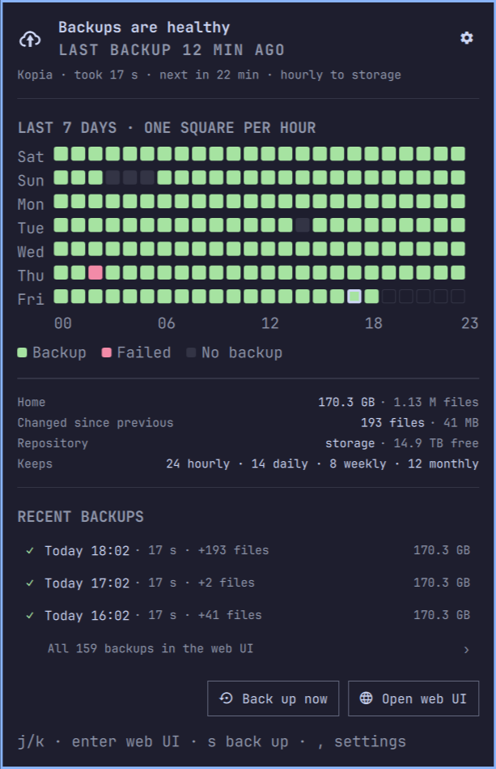
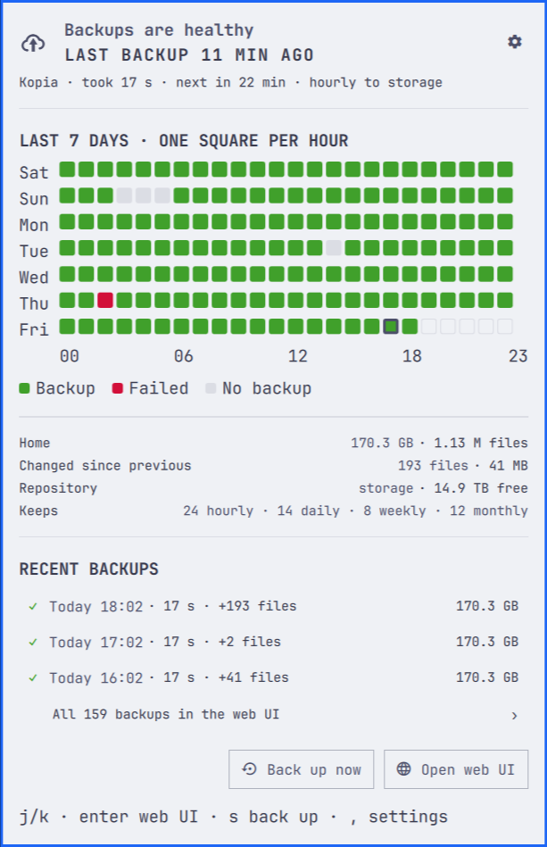

# Kopia Backups

An Omarchy bar widget for [Kopia](https://kopia.io) backups run by a systemd user timer. The icon shows whether the last backup is healthy, running, failed or overdue; the panel shows a seven-day heatmap, sizes, retention and the last snapshots, with a desktop notification when a backup fails.

## Requirements

- Omarchy with the Quattro shell.
- The Kopia CLI connected to a repository (`kopia repository connect ...`).
- A systemd user service that runs `kopia snapshot create <path>` and a timer that starts it. The plugin never runs a backup on its own schedule; it reads what Kopia already did.

## Install

    omarchy plugin add https://github.com/steveclarke/omarchy-kopia --enable

## Settings

Open the panel and press the gear (or `,`):

- Bar text: icon only, time until the next backup, or the last backup time
- Warn after N hours without a backup
- Source path, backup service and schedule unit names
- History days shown in the grid
- Show the Back up now button; web UI address
- Web UI sign-in: a username and the path to a file holding `KOPIA_SERVER_PASSWORD=...` (the same file a systemd `EnvironmentFile=` for `kopia server start` reads). The file must be yours and not readable by others (`chmod 600`). Sign-in needs an `https://` address, or `http://` to this machine only (`127.0.0.1` or `[::1]`); anything else opens the plain address and the browser asks. Only the file's path is saved in the shell config.
- Notify when a backup fails; notify when a backup is overdue

## Preview

Sample data; the panel follows the active Omarchy theme.

| Dark | Light |
|------|-------|
|  |  |

## What it runs, reads and writes

- Reads backups with `/usr/bin/kopia snapshot list`, `repository status` and `policy show`, and the timer with `/usr/bin/systemctl --user show` and `list-timers`. Reads the failed run's log with `/usr/bin/journalctl --user`.
- "Back up now" runs `/usr/bin/systemctl --user start --no-block <service>`, the one command that changes anything. "Open log" opens `/usr/bin/xdg-terminal-exec` running `/usr/bin/journalctl --user -u <service> -e`. "Open web UI" runs `/usr/bin/xdg-open` with the configured address. With sign-in set up, `bin/kopia-web-signin` reads the password file, writes a one-use page (mode 0600) to `$XDG_RUNTIME_DIR/kopia-backups/`, opens that page, and deletes it 20 seconds later. The password is never on a command line, where other processes could read it.
- Alerts are sent with `/usr/bin/notify-send`.
- Writes only that one-use sign-in page. Settings are saved in the shell config through Omarchy's settings API.
- Makes no network requests. Nothing runs as root.

## Remove

    omarchy plugin remove io.github.steveclarke.kopia

This deletes the plugin folder. Its settings entry in `~/.config/omarchy/shell.json` may remain, and it holds only preferences such as the source path and unit names. Kopia, its repository and your systemd units are untouched. `$XDG_RUNTIME_DIR/kopia-backups/` is emptied at logout.

## License and dependencies

MIT. Needs the Kopia CLI at `/usr/bin/kopia` (the `kopia-bin` AUR package), systemd user units, `journalctl` and `notify-send`.
